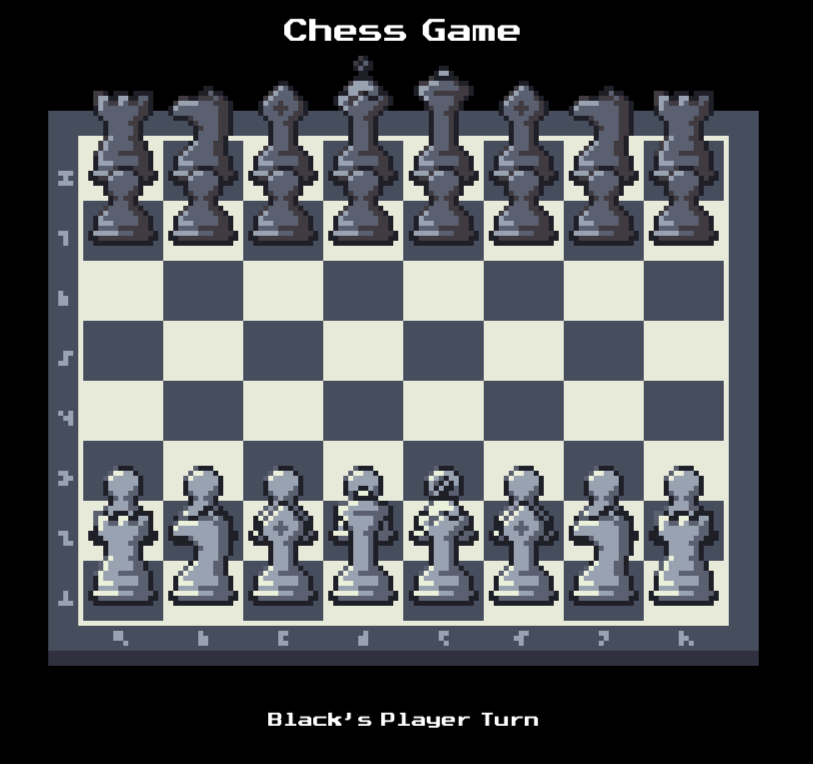
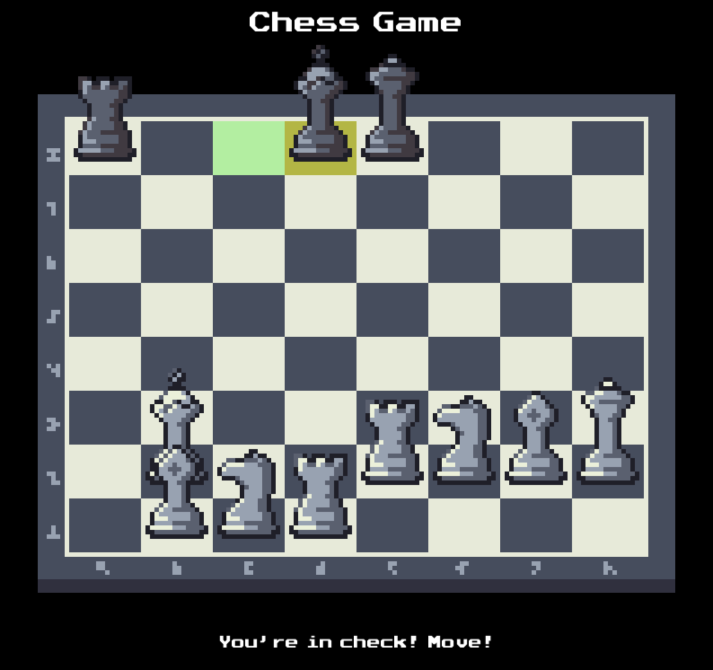

# Chess Game - C++ and SDL

 

## Technology
Compilation:
* C++20, CMake & Make.

Framework and libraries:
* SDL2
* SDL2_image
* SDL2_mixer
* SDL2_ttf
* pugixml

### Windows - Build and execute

```
cmake -B build`
cd build
cmake --build .
.\Debug\ChessGame.exe
```

### MacOS - Build and execute

```
cmake -B build
cd build
make
./ChessGame
```

## Pending TODO:
Nothing pending atm.