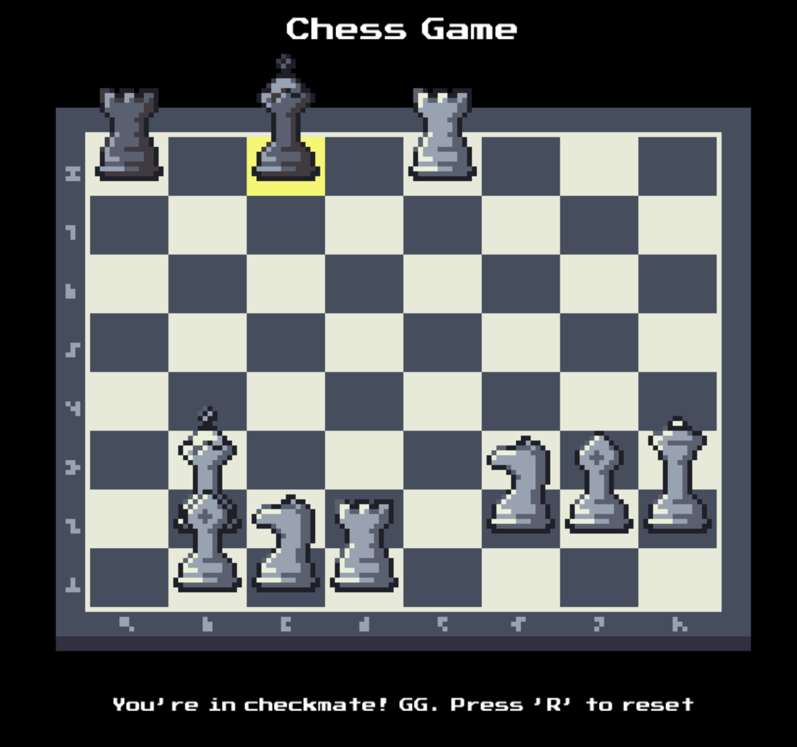

# ♟️ Chess Game - C++ & SDL

<p align="center">
  
  
  
</p>

## 🔧 Technology Stack

**Compilation:**  
- C++20  
- CMake  
- Make  

**Framework & Libraries:**  
- SDL2  
- SDL2_image  
- SDL2_mixer  
- SDL2_ttf  
- nlohmann_json  

---

## 💻 Build & Run Instructions

### 🖥️ Windows

```bash
cmake -B build
cd build
cmake --build .
.\Debug\ChessGame.exe
```

### 🍎 MacOS / Linux

```bash
cmake -B build
cd build
make
./ChessGame
```

---

### 📦 JSON Structure

The JSON file contains a **single key**:

- **`"pieces"`**: An array of exactly **32 elements** representing every piece in the game.

---

### 🔍 Pieces Array Details

Each position in the `"pieces"` array corresponds to a specific chess piece following this exact order:

| Index Range | Description                  | Example Piece Types            |
|-------------|-----------------------------|-------------------------------|
| 0 – 7      | **Black major pieces**       | Rook, Knight, Bishop, Queen, King, Bishop, Knight, Rook |
| 8 – 15     | **Black pawns**              | Pawn x8                       |
| 16 – 23    | **White pawns**              | Pawn x8                       |
| 24 – 31    | **White major pieces**       | Rook, Knight, Bishop, Queen, King, Bishop, Knight, Rook |

#### 🔗 Important Notes:
- The **value** at each index represents the position on the board (from **0 to 63**) where the corresponding piece is located.
- If a piece has been **captured**, its corresponding entry will be `null`.

---

### 🗺️ Board Index Mapping

The chessboard is flattened into a **1D array (0–63)** ordered left-to-right and top-to-bottom:


### Loading a play from JSON:
1. File path: assets/json/board_pieces.json
2. It only contains a key called "pieces" which is an array.
3. Pieces array: contains 32 positions. Each position refers to a piece from the game, starting from top left to bottom right: 
Rook, Knight, Bishop ....
Pawn, Pawn, Pawn ...
Pawn, Pawn, Pawn ...
Rook, Knight, Bishop
4. Each value in piece's array refers to an index from the Board (one-dimensional array). Those indexes go from 0 to 64 (from top left to bottom right). Each index refers to a col row value. i.e. 1 means (1, 0), 8 means (0, 1), etc.

#### Some examples:
pieces[0] = 8 -> Means black player Rook is at cell (0,1).
pieces[30] = 17 -> Means white player Knight is at cell (1, 2).

---

## 🚧 Missing Features from Official Chess Rules

These features are **not yet implemented** in the current version of the game:

- ♟️ **Pawn Promotion**: Automatically promote a pawn upon reaching the last rank.
- 🤝 **Resignation**: Allow players to manually resign the game.
- 🏳️ **Forfeit (Timeout)**: Handle player timeouts in time-controlled games.
- ☠️ **Dead Position Detection**: Detect positions where no checkmate is possible.
- 🔁 **Threefold Repetition Rule**: Declare a draw when the same position occurs three times.
- ⏱️ **Fifty-Move Rule**: Declare a draw if no pawn move or capture has occurred in the last fifty moves by each player.

---

## ✨ Potential Features to be Added

These features are **planned or could be considered** for future versions:

- ⏳ **Time Control**: Implement clocks and timers for each player to simulate real tournament conditions.
- 🤝 **Draw Offer / Acceptance**: Allow players to offer and accept draws during gameplay.
